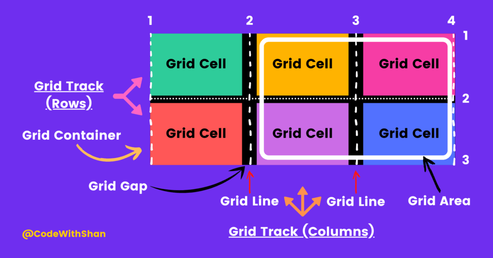

# HTML&CSS Review

This repo contains my study notes and learning projects contained in the course [Build Responsive Real-World Websites with HTML and CSS](https://www.udemy.com/course/design-and-develop-a-killer-website-with-html5-and-css3/).

## HTML Notes

- `<strong>` and ~~`<b>`~~ are both used to make texts bold. However, `<strong>` label is more recommended since it has its semantics.

- `<em>` and ~~`<i>`~~ are both used to make texts italics. However, `<em>` label, which stands for emphasize, is more recommended.

- We could add `target="\_blank"` as an attribute-value pair inside the `<a>` label so that the link would be opened in new tab.

- `<header>`(header of the html doc/smaller units), `<nav>`(for navigation links), `<article>`, `<footer>`(e.g., copyright), `<aside>`(for secondary info) are container labels for structuring html documents. They would be helpful for semantics HTML as well as CSS styling.

- useful VScode extension: auto rename tag(automatically change the closing tags when the openning tags were changed), prettier(formatter), color hightlight(for css), image preview(``), live server

## CSS Notes

- **styling text**

  - _font-size_: 26px;
  - _font-weight_: bold;
  - _font-family_: sans-serif;
  - _font-style_: italic;
  - _text-align_: center;
  - _text-transform_: uppercase;
  - _line-height_: 1.5; (1.5 times font size)

- **selector**

  - descendant selector `article header p {}`
  - list selector `h1, h2, h3, h4, p, li{}`
  - id selector `#author {}`
  - class selector `.related {}`
  - adjacent sibling selector `h3 + p {}`

- **color**

  - text color => `color: #1098ad;`
  - background color of containers => `background-color: #f7f7f7;`
  - border color => `border(-top/left/right/bottom): 5px solid #1098ad;`

- **pseudo-classes**

  - `li:first-child {}`
  - `li:nth-child(odd) {}`
  - `article p:last-child {}` iff there is a `
` element as the last child of any `<article>` element.
  - **styling hyperlinks**
    - `a:link {}` (could use `text-decoration:none` to get rid of the default underline, we could also specify our own style, e.g., `text-decoration: underline wavy orangered`)
    - `a:visited {}`
    - `a:hover {}`
    - `a:active {}`

- **psuedo-elements**

  - first letter: `h1::first-letter {}`
  - first line: `h3 + p::first-line {}`
  - create an element(inline) as the first(`before`)/last(`after`) child of the selected element`h2::after {content: "TOP";}`

- **CSS Theory1: conlicting selectors**
  - declarations marked `!important` > inline styles > ID selector > class/psudeo-class selector > element selector > universal selector
  - if there are multiple conflicts of the same level, the last selector in code will apply
- **CSS Theory2: Inheritance and the Universal Selector**
  - The children html elements would inherit the styles of their parents elements. (not all the styles would be inherited, it's mostly ones related to text)
  - universal selector applies the specified styles(including those that couldn't be inherited) to all elements, which doesn't use the mechanism of inheritance.
- **CSS Theory3: The CSS Box Model**
  - global reset:  
     `* {margin: 0; padding: 0; box-sizing: border-box; /* the default is content-box */}`
  - collapsing margins: the bigger margin between elements would be applied if both margins are specified
  - consistent with using margin-top/margin-bottom when trying to add vertical space between elements
  - `padding: 10px 20px` => the vertical paddings are 10 px and the horizontal paddings are 20px
  - a trick to center the content
    - add a div container around the content that we want to center
    - `.container{margin: 0 auto;}`
- **CSS Theory4: Types of Boxes**
  - BLOCK-LEVEL elements (`display: block;`)
    - 100% of parent's width => vertically, one after another
    - box-model could be applied
  - INLINE elements (`display: inline;`)
    - occupies only content's space => causes no line breaks
    - box-model is differently applied
      - hieghts and widths do not apply
      - paddings and margins only apply horizontally
  - INLINE-BLOCK elements (`display: inline-block;`)
    - Looks like inline from the outside(occupies only content's space)
    - Behaves like block-level on the inside(box-model applies as showed)
- **CSS Theory5: Absolute Positioning**
  - normal flow: elements are laid out according to their order in the HTML code
  - absolute positioning: no impact on surrounding elements, might overlap them
  - the way to use: Add `position: absolute;` for the element and set its top/bottom/left/right (e.g., `top: 5px;`). The element would be put based on these attributes relatively to its closest parent element with `position: relative` specified.

## Layouts

- **Float**
  - `float: left;` `float: right;`
  - element is removed from the normal flow
  - text and inline elements will wrap around the floated element
  - the container will not adjust its height to the element  
    => collapsing height
    - clearfix hack  
      `.clearfix::after{content: ""; display: "block"; clear: both;}`  
      Clearfix only works when the selected element is a block element.  
      `after` pseudo-element only works when the content has been specified.
    - alternative way  
      Add an empty block element as the next sibling element(e.g., `

`).  
      And then do `.clear {clear: both;}` in the corresponding CSS file.
- **Flexbox**
  - `display: flex;`
  - terminology:  
    
  - properties for
    - flex container
      - 🦍`gap: 0;` | `<length>`  
        To create space between items, without using margin
      - 🦍`justify-content: flex-start;` | `flex-end` | `center` | `space-between` | `space-around` | `space-evenly`  
        To align items along main axis (horizontally)
      - 🦍`align-items: stretch;` | `flex-start` | `flex-end` | `center` | `baseline`  
        To align items along cross axis (vertically)
      - `flex-direction: row;` | `row-reverse` | `column` | `column-reverse`  
        To define which is the main axis
      - `flex-wrap: nowrap;` | `wrap` | `wrap-reverse`  
        To allow items to wrap into a new line if they are too large
      - `align-content: strech;` | `flex-start` | `flex-end` | `center` | `space-between` | `space-around`  
        Only applies when there are multiple lines(`flex-wrap: wrap;`)
    - flex items
      - 🦍`align-self: auto;` | `stretch` | `flex-start` | `flex-end` | `center` | `baseline`  
        To overwrite align-items for individual flex items
      - `flex-grow: 0;` | `<integer>`  
        To allow an element to grow(0 means no, 1+ means yes)
      - `flex-shrink: 1;` | `<integer>`  
        To allow an element to shrink when the container is not big enough(0 means no, 1+ means yes)
      - `flex-basis: auto;` | `<length>`  
        To define an item's width, instead of the width property
      - 🦍`flex: 0 1 auto;` | `<int> <int> <len>`  
        **Recommended** shorthand for flex-grow, -shrink, -basis
      - 🦍`order: 0` | `integer`  
        Controls order of items. -1 makes item first, 1 makes it last.
- **Grid**
  - `display: grid;`
  - terminology: cssgrid  
    
  - properties for
    - grid container
      - 🦍`grid-template-rows: <track size>*`  
        `grid-template-columns: <track size>*`  
        To establish the grid row and column tracks.
        - **px**: only use the specified space.(fixed)
        - **fr**: similar to flex-grow, would use all the remaining space of the grid container. The higher the fr is for the column/row, the more space the column/row would fill.(proportionally)
        - **auto**: only use the minimum space of neccesity.
      - 🦍`row-gap: 0;` | `<length>`  
        `column-gap: 0;` | `<length>`  
        `gap: 0;` | `<length>`  
        To create empty space between tracks.
      - 🦍`justify-items: stretch;` | `start` | `center` | `end`  
        `align-items: stretch;` | `start` | `center` | `end`  
        To align items inside rows/columns (horizontally / vertically)
      - 🦍`justify-content: start;` | `center` | `end` | `...`  
        `align-content: start;` | `center` | `end` | `...`  
        To align entire grid inside grid container.  
        Only applies if container is larger than the grid.
    - grid items
      - 🦍`grid-column: <start line> / <end line>` | `span <number>`  
        `grid-row: <start line> / <end line>` | `span <number>`  
        To place a grid item into a specific cell, based on line numbers.  
        _span_ keyword can be used to span an item across more cells.  
        **examples:**
        1. `grid-column: 1 / 3;` == `grid-column: 1 / span 2;`
        2. `grid-column: 1 / 2;` == `grid-column: 1 / span 1;` == `grid-column: 1;`
      - 🦍`justify-self: stretch;` | `start` | `center` | `end`  
        `align-self: stretch;` | `start` | `center` | `end`  
        To overwrite justify-items/align-items for single items.
